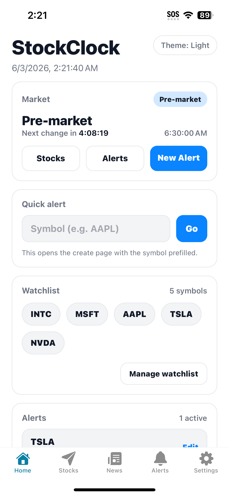
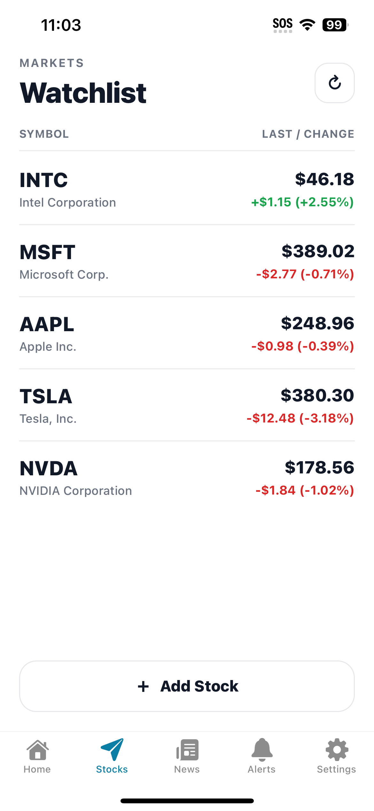
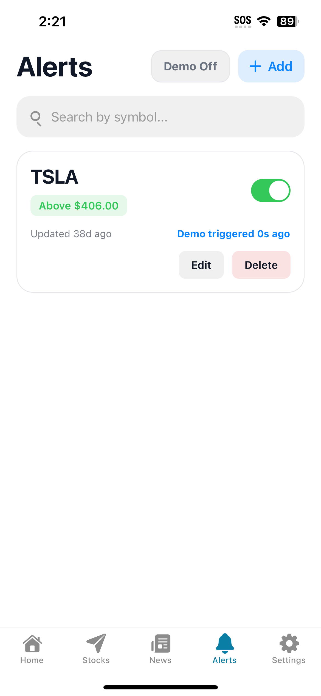
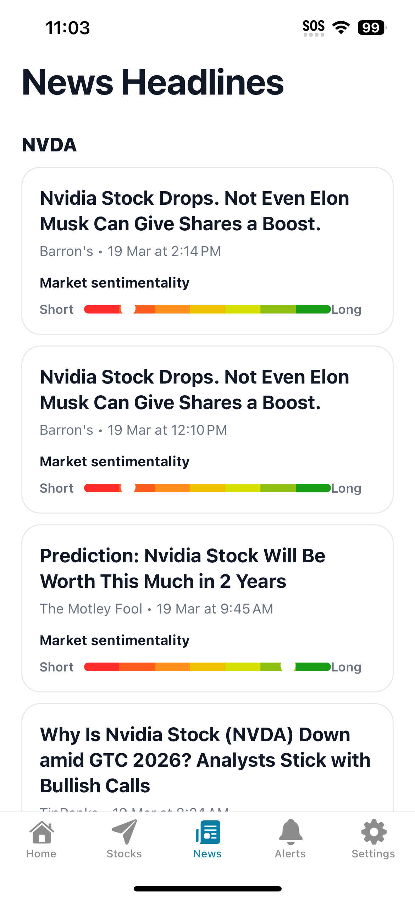
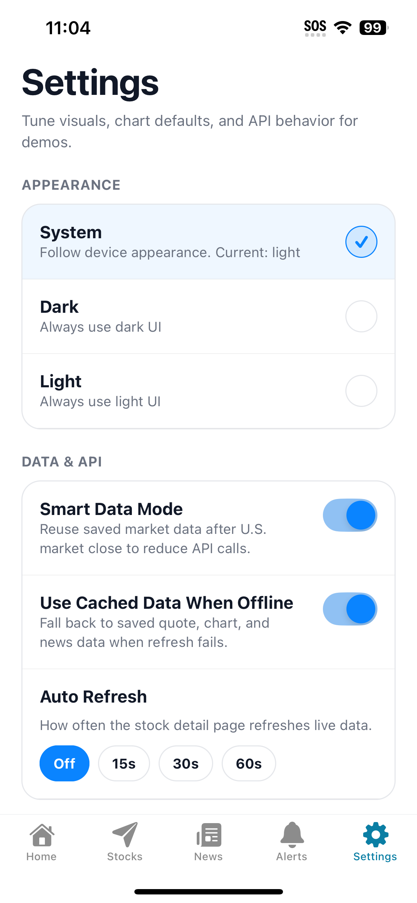

# StockClock

This project is the mobile version of the CS178 project "Stock Clock" implemented using the Expo platform. The application focuses on providing a lightweight interface for monitoring stock prices, featuring a watchlist, price alerts, detailed stock information, and market sentiment analysis. This program aims to offer a simple and efficient solution for non-professional stock traders.

## App Screenshots

### Home


### Stock Detail


### Alerts


### News


### Settings


## Current Features

- Real-time stock ticker search and a customizable watchlist

- Real-time market data retrieval with local price caching capabilities

- Detailed stock information pages supporting multiple timeframes and trend charts

- Precise price and timestamp lookup directly on the charts

- Stock-specific, up-to-the-minute news updates on the details page

- Support for creating and modifying custom price alerts, complete with a demo toggle

- News Feed: Filter news by specific stocks, featuring a sentiment indicator bar and in-app article reading

- Offline Accessibility: Automatically loads cached historical news when the device is offline

- Personalized Theme Settings: Light mode, Dark mode, and System Preference Sync

- Comprehensive Configuration Options: Smart Data Mode, Cache Fallback Strategy, Auto-Refresh Frequency, Default Chart Timeframe, and News Display Quantity

## Recent Project Updates

The current version incorporates the following improvements based on actual user experience:

- **Stock Details Feature Upgrades**
- Added more chart time-range options, including intraday hourly intervals. This modification serves as a compromise for situations where more complex charting visualizations cannot be fully implemented.
- Users can now configure the default time-range option for the Stock Details page within the Settings menu.
- A dedicated "News" section has been newly added to the Stock Details page for quick access to relevant headlines.

- **News Browsing Experience Enhancements**
- Integrated an in-app browser; users no longer need to be redirected to their device's default browser when tapping on a news article.
- Implemented an offline caching mechanism for news content; when no internet connection is available, the app automatically displays the most recently cached news to prevent blank pages from appearing.

- **API Call Optimizations**
- "Smart Data Mode" automatically reduces unnecessary market data API calls during non-trading hours, effectively helping users avoid triggering usage limits on free API tiers.
- Adopted a "Cache-First" strategy, which effectively mitigates the risk of hitting API usage limits caused by frequent price updates.

- **The "Settings" Page Has Been Updated with the Following Options:**
- Theme Settings
- Smart Data Mode
- Use Cached Data When Offline
- Auto-Refresh
- Default Chart Time Range
- Number of News Articles Displayed Per Stock

## Tech Stack

- Expo
- React Native
- Expo Router
- TypeScript
- Twelve Data API
- react-native-svg
- AsyncStorage
- expo-web-browser

## Project Structure

```text
app/            Main screens and routes
components/     Shared UI components
constants/      Theme and app constants
hooks/          Custom hooks
services/       API and data logic
assets/         App Images and static assets
screenshots/    README screenshots
```

## Requirements

Before running the project, make sure you have:

- Node.js
- npm
- Expo Go on your phone, or an iOS / Android simulator
- The news sentiment analysis feature requires the additional configuration of the FinBERT model. The link to the accompanying model set up for this project is:
https://github.com/marcencarnacion/CS178-Project/tree/main

## Setup

### 1. Clone the repository

```bash
git clone https://github.com/PYwaterfriend/stockclock.git
cd stockclock
```

### 2. Install dependencies

```bash
npm install
```

### 3. Install required Expo packages

```bash
npx expo install react-native-svg @react-native-async-storage/async-storage expo-web-browser
```

### 4. Add your Twelve Data API key

Open:

```text
services/marketData.ts
```

Replace the API key placeholder with your own Twelve Data API key.

Example:

```ts
export const TWELVE_DATA_API_KEY = "YOUR_API_KEY_HERE";
```

## Running the App

Start the project with:

```bash
npx expo start
```

Then:

- Scan the QR code using Expo Go
- Or run it in a simulator

If Metro or bundling behaves strangely, clear cache:

```bash
npx expo start -c
```

## Notes on Data and Display Behavior

### Smart Data Mode

"Smart Data Mode" is designed to minimize API usage—particularly for free API tiers—during the iterative testing phase of development. When this feature is enabled, rapid data refreshes occurring within a short timeframe (5 minutes) will not trigger new API requests; instead, the application will utilize previously cached local data.

### Cached Data Fallback Mechanism

If this feature is enabled within the "Settings," the application will automatically revert to the data from the last successful request—including stock prices and the latest charts—should a real-time data request fail. This mechanism helps prevent functional disruptions within the application during periods of network instability. However, if no cached data is available, the feature will remain non-functional.

### News Data Backend

The data displayed on the "News" tab relies on either a local or a custom backend service interface. Following the download of the application, the backend service must be manually configured. If the backend service is currently unavailable but news data has been successfully loaded in the past, the application will still be able to display cached news headlines along with their corresponding sentiment indicators.

## Troubleshooting

### Market Data Not Displaying

Please check:

- Whether the Twelve Data API key is correctly configured in the `services/marketData.ts` file.
- Whether the free API call limit has been exceeded (a red text alert will appear within the app).
- During market closure hours, "Smart Data Mode" may not automatically fetch the latest data; instead, it will automatically continue to use cached data.

### News Content Not Displaying

Please check:

- The operational status of your backend server.
- Whether the news API URL within the project matches your local backend address.
- If you require the news page to remain visible while offline, please check whether "Cache Fallback" has been enabled.

### Dependency issues

Try reinstalling:

```bash
rm -rf node_modules package-lock.json
npm install
```

On Windows, the program may not automatically delete `node_modules`; instead, it requires manual deletion.

## Team Project

CS178 StockClock Project  
Mobile Version